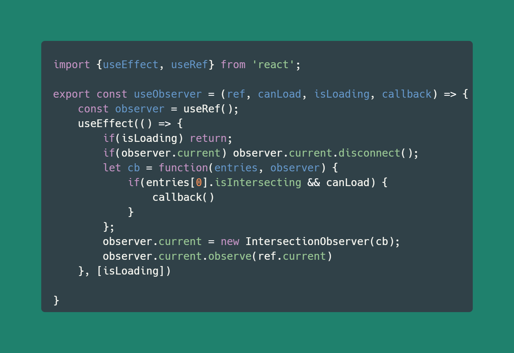

 

What is {JSON}Placeholder App? 
=============

It is a simple App which is working with {JSON}Placeholder API.
It was created as a "battlefield" to practice my skills in  React.js, its hooks, responsive design, etc.

#### It gives you an ability to :
                
1. Create, open, delete your own posts.
2. See an APIs posts.
3. Sort and search posts.

### To create this app i used:

- Functional Components only
- Hooks (useState, useEffect, useRef, useMemo, etc.) and custom Hooks
- CSS modules, plain CSS, SCSS

### Additional features:

- Preloaders
- Infinite scroll
- Responsive design
- Animations made from scratch

## Available Scripts

In the project directory, you can run:

### `npm start`

Runs the app in the development mode.\
Open [http://localhost:3000](http://localhost:3000) to view it in your browser.

# OR You can try it here: [Link to an app](https://thesaddest.github.io/react-blog/ "Heading link")

